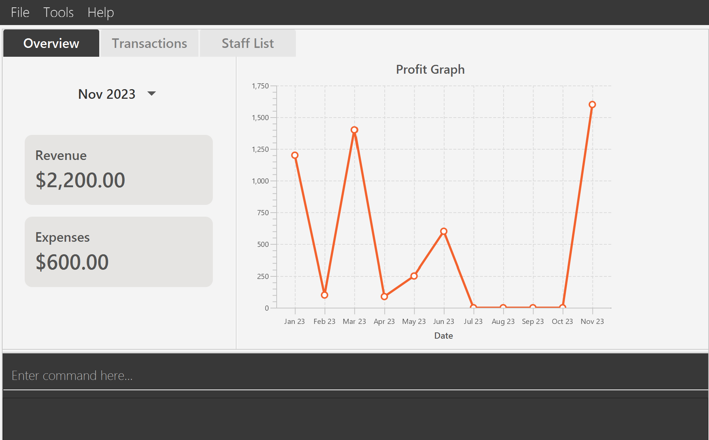

**Tran$act** is a simple and easy to use transaction recorder and tracker built in Java.

---

## Quick start

1. Ensure you have Java `11` or above installed in your Computer.

1. Download the latest `transact.jar` from [here].

1. Copy the file to the folder you want to use as the _home folder_ for your tran$act.

1. Open a command terminal, `cd` into the folder you put the jar file in, and use the `java -jar transact.jar` command to run the application. 
   A GUI similar to the below should appear in a few seconds. Note how the app contains some sample data. 
   

1. Refer to the [Features](#features) below for details of each command.

---

## Features

Tran$act offers a range of features designed to make transaction recording and management a seamless process. These features are tailored to the needs of accountants and finance professionals in small businesses, allowing for efficient data entry and financial reporting. Here's an overview of the key features:

**1. Adding Transactions**

Tran$act allows you to add transactions with ease. Specify the transaction type, description, amount, date, and optionally, the associated person. The system validates your input data and records the transaction in the database.

**2. Removing Transactions**

Remove transactions from your records with ease. Simply select the transaction you wish to delete, and the system will confirm the removal before removing it from the database.

**3. Viewing All Transactions**

View a comprehensive list of all recorded transactions for reference. This list provides an overview of all financial activities in one place.

**4. Editing Transactions**

Need to make corrections or updates to transaction records? Tran$act allows you to edit transaction details, ensuring your records are accurate.

**5. Dashboard Display**

Upon opening the app, you'll be greeted with a clear and concise dashboard. The dashboard displays essential financial information, including total income, total expenses, net profit for the selected period.

**6. Export of transactions in csv format**

For those who need to share data with stakeholders, Tran$act allows you to generate CSV report.

**7. Address Book**

Import staff lists into the address book for quick access to contact information. You can also add, edit, and remove people from the address book as needed.

---
## Usage

**:information_source: Notes about the command format:**

- ?: Optional Field
- <description>: Any string
- <type>: [Revenue (R), Expense (E)]
- <amount>: Any number
- <date>: In dd/mm/yy format
- <staff>: Name of staff

### Adding transaction : `add`

Format: `add <type> <description> a/<amount> <date> <?staff>`

Examples:

- `add R Sold 1 Mug a/10 10/10/23 John`
- `add E “Paid Manufacturer” 100 10/11/23`

Success/Fail Output:

- Added revenue (Toast)
- Added expenditure (Toast)
- Error: <Error Message> (Toast)

### Removing transaction: `del`

Format: `del <id>`

Example:`del 1`

Success/Fail Output:

- Removed transaction (Toast)
- Error: <Error Message> (Toast)

### Viewing transactions : `view t`

Switches UI to transaction tabs, which shows the full list of transactions

Format: `view t` or `view transaction`

### Adding staff : `addstaf`

Format: `addstaff n/<name> p/<phone no> e/<email> a/<address> [t/<tag>]`

Success/Fail Output:

- Added staff (Toast)
- Error: <Error Message> (Toast)

### Removing staff: `delstaff`

Format: `delstaff <staff id>`

Example: `delstaff 1`

Success/Fail Output:

- Removed staff (Toast)
- Error: <Error Message> (Toast)

### Viewing staff : `view s`

Switches UI to staff tabs, which shows the full list of staff

Format: `view s` or `view staff`

### Exiting the program : `exit`

Exits the program.

Format: `exit`

### Saving the data

transact data are saved in the hard disk automatically after any command that changes the data. There is no need to save manually.

---

## FAQ

---

## Known issues

---

## Command summary

| Action                 | Format, Examples                                                 |
| ---------------------- | ---------------------------------------------------------------- |
| **Add transaction**    | `add <type> <description> a/<amount> <date> <?staff>`            |
| **Remove transaction** | `del <id>`                                                       |
| **View transaction**   | `view t` or `view transaction`                                   |
| **Add staff**          | `addstaff n/<name> p/<phone no> e/<email> a/<address> [t/<tag>]` |
| **Remove staff**       | `delstaff <staff id>`                                            |
| **View staff**         | `view s` or `view staff`                                         |

## Glossary

| Term        | Definition                                             |
| ----------- | ------------------------------------------------------ |
| Transaction | An exchange of money (e.g. Income / Expense)           |
| Transactor  | Person associated with the transaction                 |
| Income      | Money received (e.g. Product Sale)                     |
| Expense     | Costs incurred (e.g. Staff salary, cost of production) |
| Command     | An input into the text box to carry out actions        |
